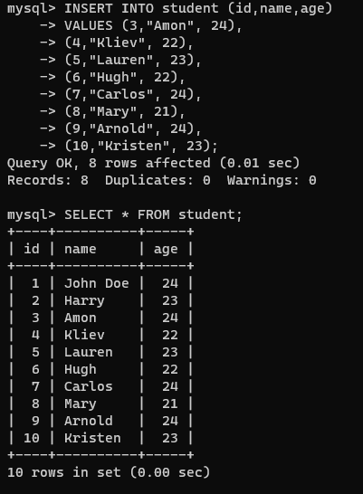

#sqlCommands 
## INSERT : 

**Definition :** Allows users to insert data in database tables.

SYNTAX : 
```
INSERT INTO TABLE_NAME ( column_Name1 , column_Name2 , column_Name3 , .... column_NameN )  VALUES (value_1, value_2, value_3, .... value_N ) ;
```

**Example :**
```
INSERT INTO table_name 
(rollNo,name) VALUES 
(1,"John Doe"),
(2, "Anything");
```

>  Writing column name helps remembering order of values to put in because if the order changes then the column it will be put into will change as well which could lead to datatype errors and misplaced information. 
>  
>  For Example:

Output of Above Query:

| rollNo | Name     |
| ------ | -------- |
| 1      | JohnDoe  |
| 2      | Anything |
> Hence, we can understand which value comes first and which column datatype is INT and which is VARCHAR (String).

Example:

## UPDATE :

**Definition :** Allows users to update or modify the existing data in database tables.

SYNTAX :
```
UPDATE _table_name_  
SET _column1_ = _value1_, _column2_ = _value2_, ...  
WHERE _condition_;
```

Example :
```
UPDATE student
SET subject = "Biology"
WERE subject = "Bio"; 
```
## DELETE :

**Definition :** Allows users to remove single or multiple existing records from the database tables.

> Unlike the ***DROP statement***, which removes the entire table, the **DELETE statement*** removes data (rows) from the table retaining only the table structure, constraints, and schema
> 
> We use the WHERE clause with the DELETE command to select specific rows from the table.

SYNTAX :
```
DELETE FROM Table_Name WHERE condition;
```

To delete every record in the table (basically empty the table):
```
DELETE FROM Table_Name;
```

Example :
```
DELETE FROM student WHERE stud_id = 101;
```