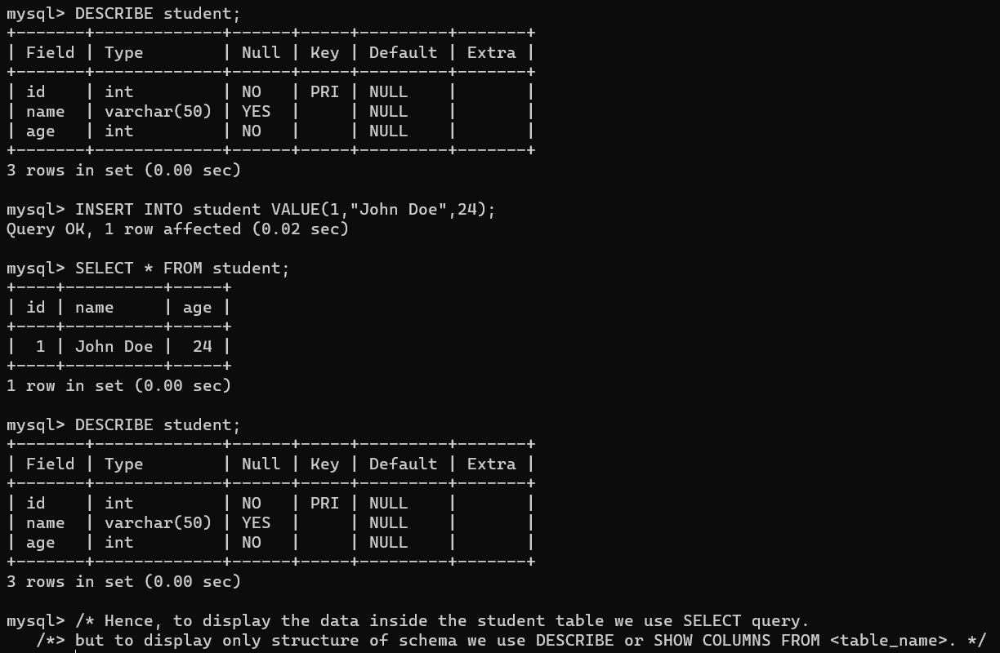

#sqlCommands #tableQuery

It is a subset of [SQL (Structured Query Language)](SQL%20(Structured%20Query%20Language).md)


## Commands:

## SELECT:

SYNTAX:
```
SELECT * FROM table_name;
```

BREAKDOWN:
> `SELECT` : 
> `*` : select all columns.
> `FROM` : command to specify the table.
> `table_name` : name of table.
## DESCRIBE: 

The DESCRIBE command displays metadata about the columns, indexes, and data partitions of tables or views. This command can also display metadata about the output of SELECT, CALL, or XQuery statements.

### SELECT vs DESCRIBE

>Example: 
>
