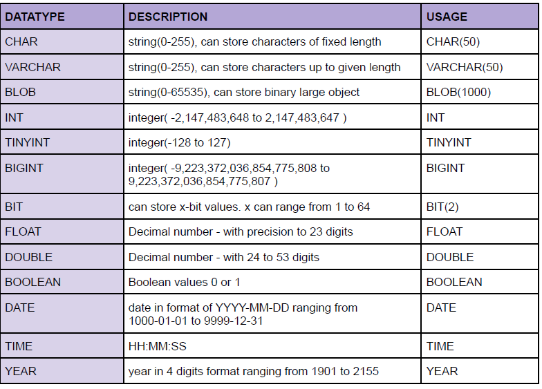
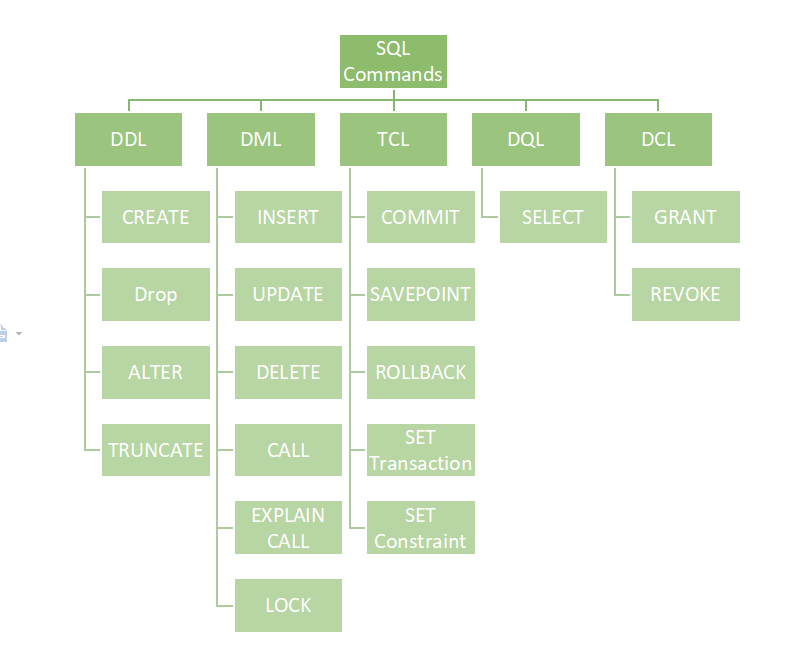

#sql #sqlCommands 

SQL, or Structured Query Language, is a language designed to allow both technical and non-technical users to query, manipulate, and transform data from a relational database. And due to its simplicity, SQL databases provide safe and scalable storage for millions of websites and mobile applications.

We use SQL for CRUD Operations :
- CREATE - To create databases, tables, insert tuples in tables etc.
- READ - To read data present in the database.
- UPDATE - Modify already inserted data.
- DELETE - Delete database, table or specific data point/tuple/row or multiple rows.

> FUN FACT :-
> SQL was invented in the 1970s by IBM, based on the relational data model.
> 
> It was originally known as SEQUEL (**structured English query language**).
> 
> Oracle, formerly known as **Relational Software**, became the first vendor to offer a commercial SQL relational database management system.

## SQL Data Types
In SQL, data types define the kind of data that can be stored in a column or variable.

Some Frequently used Data Types are:

[All data types of MYSQL](https://dev.mysql.com/doc/refman/8.0/en/data-types.html)

>**Note** - CHAR is for fixed length & VARCHAR is for variable length strings. Generally,
  VARCHAR is better as it only occupies necessary memory & works more efficiently.

## SQL Commands

#### 1.  [DQL (Data Query Language)](DQL%20(Data%20Query%20Language).md) : Used to retrieve data from databases. (SELECT)

> Although often considered part of DML, the SQL `SELECT` statement is strictly speaking an example of DQL. When adding `FROM` or `WHERE` data manipulators to `SELECT` , the statement is then considered part of the DML.
#### 2. [DDL (Data Definition Language)](DDL%20(Data%20Definition%20Language).md) : Used to create, alter, and delete database objects like tables, indexes, etc. (CREATE, DROP, ALTER, RENAME, TRUNCATE)
#### 3. [DML (Data Manipulation Language)](DML%20(Data%20Manipulation%20Language).md) : Used to modify the database. (INSERT, UPDATE, DELETE)
#### 4. DCL (Data Control Language) : Used to grant & revoke permissions. (GRANT, REVOKE)
#### 5. TCL (Transaction Control Language) : Used to manage transactions. (COMMIT, ROLLBACK, START TRANSACTIONS, SAVEPOINT)

> `DESCRIBE` : considered a metadata command used to retrieve information about the structure of database objects, primarily tables.

## Keys in SQL :

Keys are one of the basic requirements of a relational database model. It is widely used to identify the tuples(rows) uniquely in the table. We also use keys to set up relations amongst various columns and tables of a relational database.

---
### Types of Keys : 

- Candidate Key
- Primary Key
- Super Key
- Alternate Key
- Foreign Key
- Composite Key

(for in-depth knowledge refer to : [Types of Keys in SQL](Types%20of%20Keys%20in%20SQL.md))

---
### Important Keys in SQL

**Primary Key :**
- It is a column (or set of columns) in a table that uniquely identifies each row. (a unique id)
- There is only 1 PK & it should be NOT null.
---
**Foreign Key :**
- A foreign key is a column (or set of columns) in a table that refers to the primary key in another table.
- There can be multiple FKs.
- FKs can have duplicate & null values.
---
