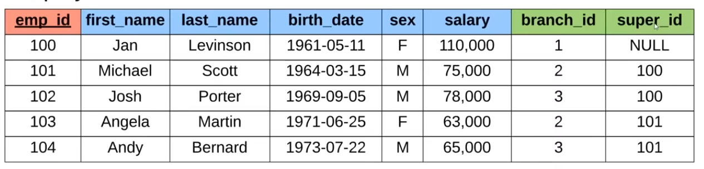

#sql 

## 1. Candidate Key:
#### Definition:
A Candidate Key is a set of one or more fields/columns that can identify a record uniquely in a table. There can be multiple Candidate Keys in one table. Each Candidate Key can work as a Primary Key.

> The value for the Candidate key is always unique and non-null for all the tuples types.
>  
> Every table has to have at least one Candidate key, but there can be more than one candidate key can be there in a table.
> 
> Basically a ***Candidate Key*** is a ***super key*** with no repeated data.

## 2. Super Key :

#### Definition:
A super key is a set of one or more than one key that can be used to identify a record uniquely in a table. 
**Example:** Primary key, Unique key, and Alternate key are a subset of Super Keys.

## 3. Primary Key :
#### Definition :
A primary key is a set of one or more fields/columns of a table that uniquely identify a record in a database table. It can not accept null, or duplicate values.

- Only one Candidate Key can be the Primary Key.
- Out of all the candidate keys that can be possible or created for the specific table, there should be only one key that can be used to retrieve unique tuples from the table.
- It is a thumb rule that there can be one Primary key that should be there for a table.
- It can identify only one tuple (a record) at a time.
#### Example :
> 
>We can see here that there are students with same name and in same major , so we can separate them using Primary Key i.e. `student_id`

#### Relation Diagram from [GeeksforGeeks](https://www.geeksforgeeks.org/types-of-keys-in-relational-model-candidate-super-primary-alternate-and-foreign/)

## 4. Foreign Key :

## 5. Alternate Key:

An Alternate key is a key that can work as a primary key. It is a candidate key that currently is not a primary key. It is also called a secondary key.

## 6. Composite/Compound Key:
A composite Key is a combination of more than one field/column of a table. It can be a Candidate key or a primary key.

> It gets its importance when it's not possible for a single column/attribute to uniquely identify all the records of a table. It acts as a primary key if there is no primary key in a table.

## 7. Unique Key

Unique Key can be a column or set of columns that can be used to uniquely identify the tuple from the database. One or more fields can be declared as a unique Key. 

The unique Key column can also hold the NULL value. The use of unique keys improves the performance of data retrieval. It makes searching for records from the database much faster & efficient.
## Difference between Keys:

Table from [scholarhat](https://www.scholarhat.com/tutorial/sqlserver/different-types-of-sql-keys)

